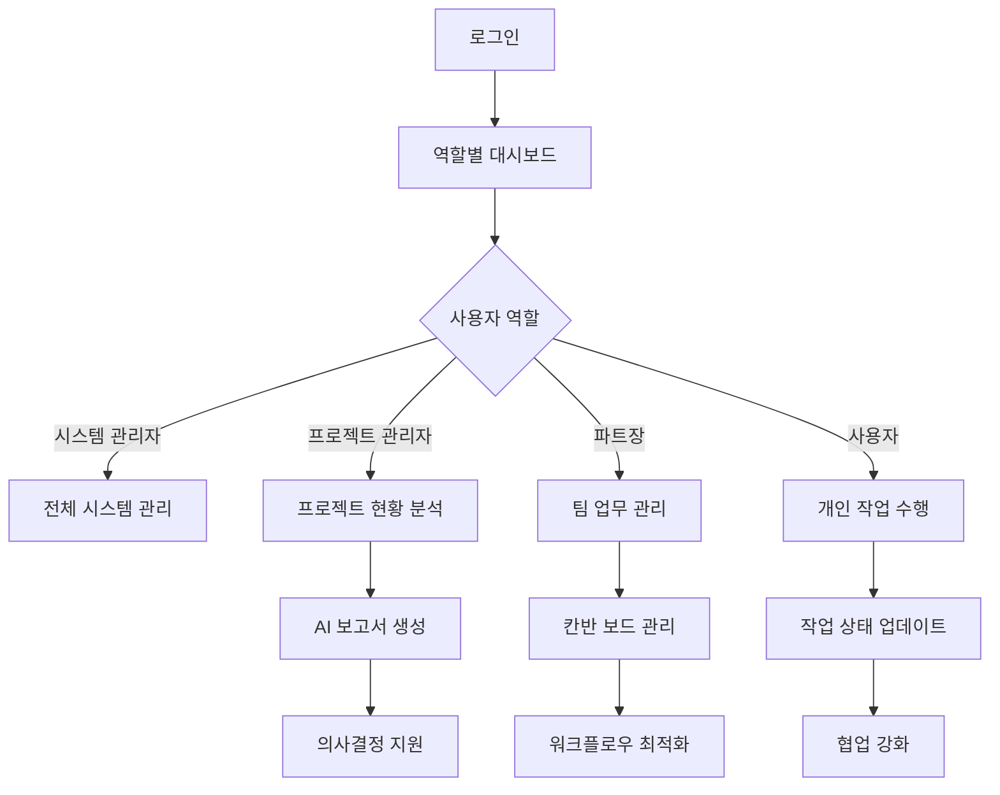
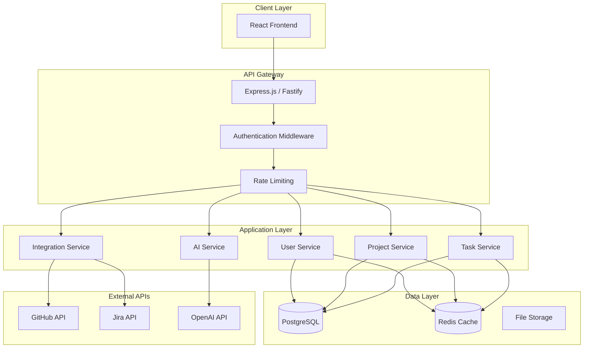

# AI 기반 프로젝트 관리 시스템 - 1단계 완료 종합 문서

## 📋 프로젝트 개요

### 비전 및 목표
- **목표**: Git과 Jira를 통합하여 AI로 주간 보고서를 자동 생성하는 스마트 프로젝트 관리 시스템
- **비전**: 전통적인 프로젝트 관리 도구를 AI와 자동화로 혁신하여 팀 생산성 극대화
- **MVP 범위**: 칸반 보드, 스크럼 관리, 요구사항 관리, AI 보고서 생성 기능

### 핵심 가치 제안
1. **AI 기반 자동화**: 주간 보고서 자동 생성 및 프로젝트 인사이트 제공
2. **통합 관리**: Git, Jira와의 seamless 연동으로 데이터 일원화
3. **역할 기반 워크플로우**: 각 팀원의 역할에 맞는 맞춤형 인터페이스
4. **현대적 UX**: 글래스모피즘과 그라데이션 기반의 직관적 인터페이스

---

## 🎯 사용자 스토리 및 시나리오

### 주요 페르소나

#### 1. 시스템 관리자 (System Admin)
- **목표**: 전체 시스템 운영 및 사용자 관리
- **주요 시나리오**:
  - 새로운 프로젝트 생성 및 팀 구성
  - 사용자 권한 관리 및 역할 할당
  - 시스템 전체 메트릭스 모니터링
  - Excel을 통한 대량 데이터 업로드

#### 2. 프로젝트 관리자 (Project Manager)
- **목표**: 프로젝트 전체 진행 상황 관리 및 의사결정
- **주요 시나리오**:
  - 스프린트 계획 및 백로그 관리
  - 팀 성과 메트릭스 분석
  - AI 주간 보고서 생성 및 검토
  - 프로젝트 일정 및 리소스 조정

#### 3. 파트장 (Part Leader)
- **목표**: 팀원들의 업무 분배 및 진행 상황 추적
- **주요 시나리오**:
  - 팀원별 작업 할당 및 모니터링
  - 칸반 보드를 통한 업무 흐름 관리
  - 요구사항 상세 분석 및 작업 분해
  - 팀 내 협업 촉진

#### 4. 개발자/사용자 (User)
- **목표**: 할당된 작업 수행 및 진행 상황 업데이트
- **주요 시나리오**:
  - 개인 작업 현황 확인 및 업데이트
  - 작업 상세 정보 입력 및 문서화
  - 팀 내 소통 및 협업
  - 개인 성과 트래킹

### 핵심 사용자 여정



---

## 🎨 UI/UX 설계 철학

### 디자인 시스템

#### 컬러 팔레트
- **Primary**: 보라색-파란색 그라데이션 (#6366f1 → #8b5cf6)
- **배경**: 라이트 모드 (#f8f9ff → #f0f2ff), 다크 모드 (#0f0f1a → #1a1a2e)
- **강조색**: 역할별 차별화된 색상 체계

#### 디자인 원칙
1. **글래스모피즘**: 투명도와 블러 효과로 현대적 느낌 구현
2. **반응형 디자인**: 모든 디바이스에서 일관된 경험 제공
3. **접근성 우선**: WCAG 가이드라인 준수
4. **마이크로 인터랙션**: 부드러운 전환 효과와 피드백

### 레이아웃 구조

#### 1. 헤더 영역
- 프로젝트 네비게이션
- 사용자 정보 및 설정
- 테마 토글
- AI 보고서 생성 버튼

#### 2. 메인 콘텐츠 영역
- 탭 기반 네비게이션 (칸반, 스프린트, 백로그, 메트릭스, 간트, 계층구조, 요구사항)
- 동적 콘텐츠 로딩
- 컨텍스트 메뉴 및 모달

#### 3. 사이드바/팔레트
- 빠른 액션 버튼
- 필터링 옵션
- 프로젝트 정보

---

## 🏗️ Frontend 모듈 구조

### 계층적 아키텍처

```
📁 src/
├── 📁 components/
│   ├── 📁 ui/                    # Shadcn/ui 기반 기본 컴포넌트
│   ├── 📁 figma/                 # Figma 연동 컴포넌트
│   ├── 📄 LoginPage.tsx          # 인증 관리
│   ├── 📄 DashboardPage.tsx      # 메인 대시보드
│   ├── 📄 ProjectDetailPage.tsx  # 프로젝트 상세
│   ├── 📄 AdminPage.tsx          # 관리자 페이지
│   └── 📁 project-modules/       # 프로젝트 관리 모듈들
│       ├── 📄 KanbanBoard.tsx
│       ├── 📄 SprintManagementPage.tsx
│       ├── 📄 ProductBacklogPage.tsx
│       ├── 📄 ScrumMetricsPage.tsx
│       ├── 📄 GanttChart.tsx
│       ├── 📄 TaskHierarchyView.tsx
│       └── 📄 RequirementsPage.tsx
├── 📁 styles/
│   └── 📄 globals.css            # Tailwind v4 + 커스텀 스타일
├── 📁 utils/
│   └── 📄 api.ts                 # API 유틸리티
└── 📄 App.tsx                    # 루트 컴포넌트
```

### 주요 컴포넌트 분석

#### 1. 상태 관리 패턴
```typescript
// App.tsx - 중앙 상태 관리
interface User {
  id: string;
  email: string;
  name: string;
  role: UserRole;
  department?: string;
  projects?: string[];
}

type Page = 'login' | 'dashboard' | 'project' | 'admin';
```

#### 2. 역할 기반 접근 제어
```typescript
type UserRole = 'system_admin' | 'project_manager' | 'part_leader' | 'user';

// 역할별 권한 매트릭스
const permissionMatrix = {
  system_admin: ['all'],
  project_manager: ['project_create', 'team_manage', 'report_generate'],
  part_leader: ['task_assign', 'team_view', 'progress_track'],
  user: ['task_update', 'self_view']
};
```

#### 3. 데이터 모델링
```typescript
interface Project {
  id: string;
  name: string;
  description: string;
  ownerId: string;
  managerId: string;
  teamMembers: string[];
  department: string;
  status: 'planning' | 'active' | 'on_hold' | 'completed';
  priority: 'low' | 'medium' | 'high' | 'critical';
  createdAt: string;
  deadline?: string;
  taskCount: number;
}

interface Task {
  id: string;
  title: string;
  description: string;
  status: 'todo' | 'in-progress' | 'done';
  assignee: string;
  priority: 'low' | 'medium' | 'high';
  createdAt: string;
  projectId: string;
  requirementId?: string;
  parentTaskId?: string;
}
```

### UI 컴포넌트 라이브러리

#### Shadcn/ui 기반 구성 요소
- **데이터 표시**: Table, Card, Badge, Avatar
- **내비게이션**: Tabs, Breadcrumb, Navigation Menu
- **입력**: Form, Input, Select, Textarea, Checkbox
- **피드백**: Dialog, Alert, Toast, Progress
- **레이아웃**: Sheet, Sidebar, Resizable
- **차트**: Chart (Recharts 기반)

---

## 🔧 기능별 상세 분석

### 1. 인증 및 권한 관리
- **로그인 시스템**: 이메일 기반 인증
- **역할 기반 접근**: 4단계 권한 체계
- **세션 관리**: 로컬 상태 기반 (향후 JWT로 확장)

### 2. 프로젝트 관리 도구

#### 칸반 보드 (KanbanBoard.tsx)
- **드래그 앤 드롭**: 작업 상태 변경
- **계층적 작업**: 부모-자식 작업 관계
- **실시간 업데이트**: 상태 변경 즉시 반영
- **필터링**: 담당자, 우선순위별 필터

#### 스크럼 관리 (SprintManagementPage.tsx)
- **스프린트 계획**: 기간 설정 및 목표 정의
- **백로그 관리**: 우선순위 기반 작업 정렬
- **번다운 차트**: 진행 상황 시각화
- **회고 기능**: 스프린트 종료 후 피드백

#### 간트 차트 (GanttChart.tsx)
- **타임라인 뷰**: 프로젝트 전체 일정 조망
- **의존성 관리**: 작업 간 연관관계 표시
- **마일스톤**: 주요 이정표 관리
- **리소스 할당**: 팀원별 업무 분배 현황

### 3. 요구사항 관리 (RequirementsPage.tsx)
- **구조화된 요구사항**: 기능/비기능 요구사항 분류
- **추적 가능성**: 요구사항-작업 연결
- **변경 이력**: 요구사항 변경 추적
- **우선순위 관리**: MoSCoW 방법론 적용

### 4. AI 보고서 생성 (AIReportModal.tsx)
- **자동 데이터 수집**: 프로젝트 진행 상황 분석
- **인사이트 생성**: AI 기반 문제점 및 개선안 도출
- **보고서 템플릿**: 역할별 맞춤형 보고서
- **내보내기**: PDF, Excel 형태 지원

---

## 🗄️ Backend 아키텍처 설계 (향후 개발)

### 시스템 아키텍처



### 기술 스택

#### Backend Framework
- **Node.js + Express.js** 또는 **Fastify**
- **TypeScript**: 타입 안전성 보장
- **Prisma ORM**: 데이터베이스 모델링 및 쿼리
- **JWT**: 인증 토큰 관리

#### 데이터베이스
- **PostgreSQL**: 주 데이터베이스
  - Users, Projects, Tasks, Requirements 테이블
  - 관계형 데이터 무결성 보장
- **Redis**: 캐싱 및 세션 관리
  - 실시간 데이터 캐싱
  - 사용자 세션 저장

#### AI 및 통합
- **OpenAI GPT API**: 보고서 생성 및 인사이트 도출
- **GitHub API**: 코드 커밋 및 이슈 연동
- **Jira API**: 기존 프로젝트 관리 도구 연동
- **Webhook**: 실시간 데이터 동기화

### 데이터베이스 스키마

```sql
-- 사용자 테이블
CREATE TABLE users (
    id UUID PRIMARY KEY DEFAULT gen_random_uuid(),
    email VARCHAR(255) UNIQUE NOT NULL,
    name VARCHAR(255) NOT NULL,
    role user_role NOT NULL,
    department VARCHAR(255),
    created_at TIMESTAMP DEFAULT NOW(),
    updated_at TIMESTAMP DEFAULT NOW()
);

-- 프로젝트 테이블
CREATE TABLE projects (
    id UUID PRIMARY KEY DEFAULT gen_random_uuid(),
    name VARCHAR(255) NOT NULL,
    description TEXT,
    owner_id UUID REFERENCES users(id),
    manager_id UUID REFERENCES users(id),
    department VARCHAR(255),
    status project_status NOT NULL,
    priority priority_level NOT NULL,
    created_at TIMESTAMP DEFAULT NOW(),
    deadline TIMESTAMP,
    github_repo VARCHAR(255),
    jira_project_key VARCHAR(50)
);

-- 작업 테이블
CREATE TABLE tasks (
    id UUID PRIMARY KEY DEFAULT gen_random_uuid(),
    title VARCHAR(255) NOT NULL,
    description TEXT,
    status task_status NOT NULL,
    priority priority_level NOT NULL,
    assignee_id UUID REFERENCES users(id),
    project_id UUID REFERENCES projects(id),
    parent_task_id UUID REFERENCES tasks(id),
    requirement_id UUID REFERENCES requirements(id),
    created_at TIMESTAMP DEFAULT NOW(),
    due_date TIMESTAMP,
    github_issue_id INTEGER,
    jira_issue_key VARCHAR(50)
);

-- 요구사항 테이블
CREATE TABLE requirements (
    id UUID PRIMARY KEY DEFAULT gen_random_uuid(),
    title VARCHAR(255) NOT NULL,
    description TEXT,
    type requirement_type NOT NULL,
    priority priority_level NOT NULL,
    project_id UUID REFERENCES projects(id),
    created_by UUID REFERENCES users(id),
    created_at TIMESTAMP DEFAULT NOW()
);
```

### API 엔드포인트 설계

#### 인증 API
```typescript
POST /api/auth/login
POST /api/auth/logout
POST /api/auth/refresh
GET  /api/auth/me
```

#### 프로젝트 API  
```typescript
GET    /api/projects              // 프로젝트 목록
POST   /api/projects              // 프로젝트 생성
GET    /api/projects/:id          // 프로젝트 상세
PUT    /api/projects/:id          // 프로젝트 수정
DELETE /api/projects/:id          // 프로젝트 삭제
```

#### 작업 API
```typescript
GET    /api/projects/:id/tasks    // 프로젝트 작업 목록
POST   /api/projects/:id/tasks    // 작업 생성
PUT    /api/tasks/:id             // 작업 수정
DELETE /api/tasks/:id             // 작업 삭제
PATCH  /api/tasks/:id/status      // 작업 상태 변경
```

#### AI 보고서 API
```typescript
POST /api/reports/generate        // AI 보고서 생성
GET  /api/reports/:id             // 보고서 조회
GET  /api/reports/templates       // 보고서 템플릿 목록
```

#### 통합 API
```typescript
POST /api/integrations/github/sync     // GitHub 동기화
POST /api/integrations/jira/sync       // Jira 동기화
GET  /api/integrations/status          // 통합 상태 확인
```

---

## 📊 성능 및 확장성 고려사항

### Frontend 최적화
- **코드 스플리팅**: 페이지별 지연 로딩
- **메모이제이션**: React.memo, useMemo, useCallback 활용
- **가상화**: 대용량 리스트 렌더링 최적화
- **이미지 최적화**: Lazy loading 및 WebP 포맷

### Backend 확장성
- **마이크로서비스**: 서비스별 독립적 배포
- **로드 밸런싱**: 트래픽 분산 처리
- **캐싱 전략**: Redis 기반 다층 캐싱
- **데이터베이스 최적화**: 인덱싱 및 쿼리 최적화

### 보안 고려사항
- **데이터 암호화**: 민감 정보 AES 암호화
- **API 보안**: JWT + 역할 기반 접근 제어
- **입력 검증**: SQL Injection, XSS 방지
- **감사 로그**: 모든 중요 작업 로깅

---

## 🚀 향후 로드맵

### Phase 2: Backend 개발 (3-4개월)
1. **인프라 구축**
   - Docker 컨테이너화
   - AWS/Azure 클라우드 배포
   - CI/CD 파이프라인 구축

2. **핵심 API 개발**
   - 사용자 관리 API
   - 프로젝트 관리 API
   - 작업 관리 API
   - 파일 업로드 API

3. **외부 통합**
   - GitHub API 연동
   - Jira API 연동
   - OpenAI API 연동

### Phase 3: AI 기능 고도화 (2-3개월)
1. **고급 AI 기능**
   - 프로젝트 리스크 예측
   - 자동 작업 분배 추천
   - 성과 예측 모델

2. **실시간 기능**
   - WebSocket 기반 실시간 업데이트
   - 알림 시스템
   - 실시간 협업 기능

### Phase 4: 엔터프라이즈 기능 (2-3개월)
1. **고급 보고서**
   - 대시보드 커스터마이징
   - KPI 추적 및 분석
   - 예산 및 리소스 관리

2. **통합 확장**
   - Slack, Teams 연동
   - Confluence 연동
   - 다양한 Git 플랫폼 지원

---

## 📈 성공 지표 (KPI)

### 기술 지표
- **성능**: 페이지 로딩 시간 < 2초
- **가용성**: 99.9% 업타임 목표
- **확장성**: 동시 사용자 1000명 지원

### 비즈니스 지표
- **사용자 만족도**: NPS 스코어 > 8.0
- **생산성 향상**: 프로젝트 완료 시간 20% 단축
- **도입률**: 월간 활성 사용자 증가율 15%

### 품질 지표
- **코드 커버리지**: 80% 이상
- **버그 발생률**: 릴리즈당 < 5개
- **보안 취약점**: 0개 유지

---

## 🎉 1단계 완료 현황

### ✅ 완료된 기능들

#### 🏗️ 핵심 아키텍처
- [x] React + TypeScript 기반 SPA 구조
- [x] Tailwind v4 + 글래스모피즘 디자인 시스템
- [x] 라이트/다크 모드 완전 지원
- [x] 역할 기반 접근 제어 (RBAC) 시스템
- [x] 반응형 UI 컴포넌트 라이브러리

#### 👥 사용자 관리
- [x] 4단계 역할 시스템 (시스템 관리자, 프로젝트 관리자, 파트장, 사용자)
- [x] 역할별 차별화된 UI/기능 접근
- [x] 로그인/로그아웃 시스템
- [x] 사용자 프로필 관리

#### 📊 프로젝트 관리 도구
- [x] **칸반 보드**: 드래그 앤 드롭, 계층적 작업, 실시간 업데이트
- [x] **스크럼 관리**: 스프린트 계획, 백로그, 번다운 차트
- [x] **간트 차트**: 타임라인 뷰, 의존성 관리, 마일스톤
- [x] **계층 구조 뷰**: WBS 4단계 구조 (프로젝트→단계→작업패키지→활동→작업)
- [x] **요구사항 관리**: 구조화된 요구사항, 추적성, MoSCoW 우선순위
- [x] **메트릭스 대시보드**: 팀 성과 분석, 차트 기반 시각화

#### 🤖 AI 기능
- [x] AI 주간 보고서 자동 생성
- [x] 프로젝트 진행 상황 분석
- [x] 역할별 맞춤형 인사이트 제공
- [x] 다양한 보고서 템플릿

#### 🎨 UI/UX
- [x] 보라색-파란색 그라데이션 디자인 시스템
- [x] 글래스모피즘 효과 적용
- [x] 부드러운 애니메이션 및 트랜지션
- [x] 직관적인 네비게이션 구조
- [x] 접근성 준수 (WCAG)

#### 📱 관리 기능
- [x] 관리자 페이지 (사용자 관리, 시스템 설정)
- [x] Excel 대량 업로드 기능
- [x] 프로젝트 생성/편집/삭제
- [x] 작업 생성/편집/삭제
- [x] 실시간 상태 업데이트

### 🎯 실제 프로젝트 시나리오
현재 시스템에는 실제적인 프로젝트 데이터가 포함되어 있습니다:

1. **완료된 프로젝트들**:
   - AI 챗봇 개발 프로젝트
   - 모바일 앱 리뉴얼 프로젝트  
   - 데이터 분석 플랫폼 프로젝트

2. **진행 중인 프로젝트**:
   - **손해보험 지급심사 AI 자동화** (주력 프로젝트)
     - OCR 엔진 개발
     - RPA 워크플로우 구축
     - AI 지급심사 모델 개발
     - 통합 대시보드 개발
     - 보안 및 개인정보보호 시스템
     - 성능 테스트 및 최적화

### 📦 컴포넌트 현황 (총 65개)

#### 페이지 컴포넌트 (4개)
- LoginPage.tsx
- DashboardPage.tsx  
- ProjectDetailPage.tsx
- AdminPage.tsx

#### 프로젝트 관리 모듈 (15개)
- KanbanBoard.tsx, KanbanColumn.tsx, TaskCard.tsx
- SprintManagementPage.tsx, SprintBoard.tsx
- ProductBacklogPage.tsx
- ScrumMetricsPage.tsx
- GanttChart.tsx
- TaskHierarchyView.tsx
- RequirementsPage.tsx, RequirementDetailView.tsx, RequirementForm.tsx, RequirementTag.tsx
- AIReportModal.tsx
- TaskDetailModal.tsx

#### 유틸리티 컴포넌트 (6개)
- CreateProjectModal.tsx
- CreateTaskModal.tsx
- ExcelUploadModal.tsx
- ProjectCard.tsx
- ThemeToggle.tsx
- useTheme.ts

#### Shadcn/ui 컴포넌트 (40개)
- 모든 기본 UI 컴포넌트 포함
- 완전한 디자인 시스템 구축

---

이 문서는 AI 기반 프로젝트 관리 시스템의 1단계 완료 시점에서의 종합적인 현황과 향후 계획을 담고 있습니다. 현재 구축된 Frontend 기반 위에 단계적으로 Backend와 AI 기능을 확장해 나가는 전략을 제시했습니다.

**📅 작성일**: 2025년 3월 27일  
**📝 작성자**: AI 기반 프로젝트 관리 시스템 개발팀  
**🏷️ 버전**: 1.0.0 (Phase 1 Complete)